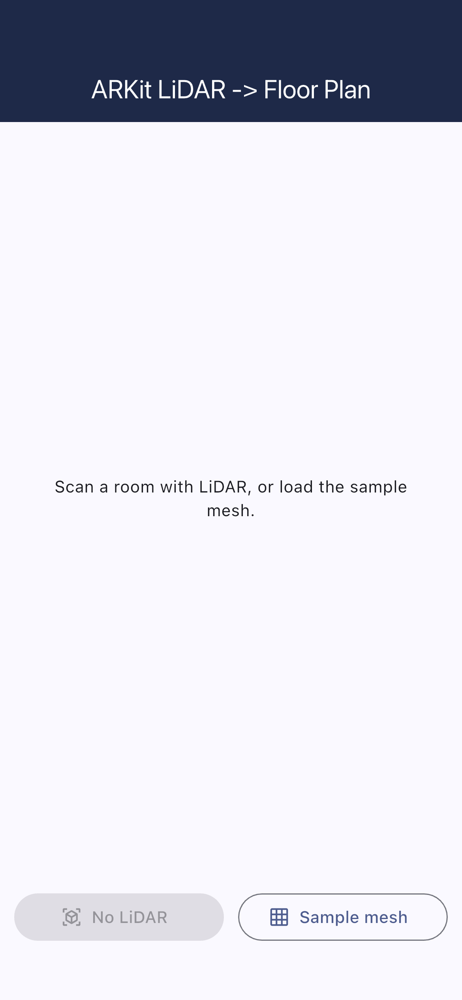
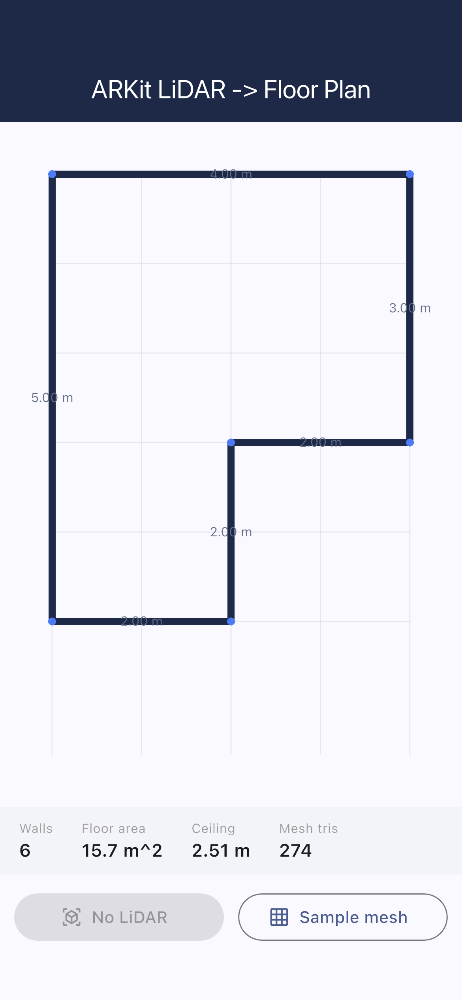
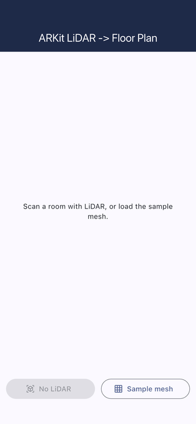

# flutter-arkit-floorplan

LiDAR mesh -> accurate 2D floor plan. A Flutter + Riverpod app with a native
**Swift / ARKit** scene-reconstruction module. Capture a room's LiDAR mesh on
device, then generate a clean top-down floor plan with wall lengths, floor
area, and ceiling height - fully on-device, no server.

This is a portfolio POC demonstrating the exact pipeline a "take ARKit LiDAR
mesh and produce floor plans" job needs: native iOS capture + cross-platform
geometry processing.

## Demo

Real iOS-Simulator captures of the running app (see [FLOW.md](FLOW.md) for how
they are generated). The synthetic LiDAR mesh runs through the real generator,
so the floor plan, wall labels, and stats are live output, not mockups.

| Scan screen | Floor plan | Plan + stats |
| --- | --- | --- |
|  |  |  |



## What it does

1. **Native capture (iOS, Swift/ARKit)** - `ArkitScannerPlugin.swift` runs an
   `ARWorldTrackingConfiguration` with `sceneReconstruction = .mesh` and
   `.sceneDepth`, collects `ARMeshAnchor` geometry, transforms vertices to
   world space, and returns vertices + faces + per-face semantic
   classification (wall/floor/ceiling/...) to Flutter over a `MethodChannel`.
2. **Floor-plan generation (Dart, cross-platform)** -
   `FloorPlanGenerator` turns the raw mesh into architectural lines:
   - estimate floor height from the lowest large horizontal surface
     (robust to furniture tops via a 10th-percentile cut),
   - select wall faces by ARKit classification, falling back to face-normal
     geometry when the LiDAR has no semantic guess,
   - project wall triangles to the floor (x,z) plane,
   - merge collinear, nearby segments so a noisy mesh wall collapses into a
     single straight line,
   - report floor area and ceiling height.
3. **Render** - `FloorPlanPainter` (CustomPainter) draws the plan fit-to-view
   with a metric grid and per-wall length labels.

## Run it without a device

ARKit scene mesh needs a LiDAR iPhone/iPad (Pro). On the simulator, Android, or
desktop, tap **Sample mesh**: a synthetic, noisy L-shaped room runs through the
exact same generator so you can see the pipeline end-to-end.

```bash
flutter pub get
flutter run            # tap "Sample mesh" on non-LiDAR targets
flutter test           # generator unit tests
```

## Architecture

```
lib/
  models/        Vec3, Mesh, Face, WallSegment, FloorPlan
  services/      ArkitScannerService (MethodChannel), FloorPlanGenerator
  providers/     Riverpod: ScanController / ScanState, scanner support
  data/          SampleMesh (synthetic LiDAR mesh for demo + tests)
  ui/            ScanScreen, FloorPlanPainter
ios/Runner/
  ArkitScannerPlugin.swift   ARKit scene reconstruction -> mesh payload
```

State is managed with `flutter_riverpod` (`StateNotifier`). The geometry math
is pure Dart and unit-tested, so it is portable and verifiable independent of
the camera.

## Notes

- iOS `NSCameraUsageDescription` is set for the LiDAR/camera scan.
- The generator's tolerances (wall/floor angle, merge thresholds, min wall
  length) are constructor parameters, so they can be tuned per scan quality.
